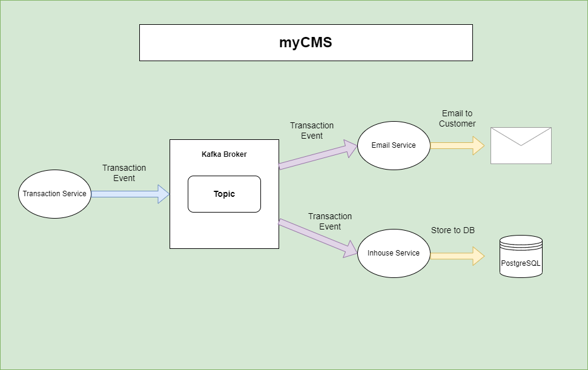

# Simple Cash Management System 
Simple Cash Management System (mycms-backend) for POC.

<p>A cash management system is used to forecast, track, and report corporate cash flows. 
The solution is especially helpful to manage cash flows (including in various currencies) across multiple,
including international, company branches and across complex bank account structures.
</p>


<h1>Event-Driven Microservice Architecture</h1>



ReactJs -> Axios HTTP request -> Spring Boot -> PostgreSQL/microservices

<h1>Module:</h1>

1. (N/A)Inhouse Transfer (Transfer cash in Account within same bank)
2. (N/A)Domestic Transfer (Transfer cash in Account with different bank and in same Country)
3. (N/A)Telegraphic Transfer/Remittance (Transfer cash in Account with different bank and different country)
4. (N/A)Service Payment
5. (N/A)Currency Live Rate (Forex)
6. [Batch Job](https://start.spring.io/#!type=maven-project&language=java&platformVersion=2.7.3&packaging=jar&jvmVersion=11&groupId=com.dzakirinmd&artifactId=batch-job&name=batch-job&description=A%20simple%20batch%20job%20for%20processing%20data%20from%20txt%20file&packageName=com.dzakirinmd.batchjob&dependencies=lombok,web,batch,postgresql,data-jpa)

<h1>Available Microservices</h1>

Click on the microservice link to go to Spring Initialzr

| Microservice                                                                                                                                                                                                                                                                                                                                                                                        | Description                                         | Tomcat Port            |
|-----------------------------------------------------------------------------------------------------------------------------------------------------------------------------------------------------------------------------------------------------------------------------------------------------------------------------------------------------------------------------------------------------|-----------------------------------------------------|------------------------|
| [springbootbackend](https://start.spring.io/#!type=maven-project&language=java&platformVersion=2.7.1&packaging=jar&jvmVersion=11&groupId=com&artifactId=springbootbackend&name=springboot-backend&description=Simple%20full%20stack%20web%20application%20for%20managing%20accounts%20in%20a%20company&packageName=com.springbootbackend&dependencies=web,data-jpa,devtools,postgresql)             | Base backend                                        | http://localhost:50000 |
| [transaction-service](https://start.spring.io/#!type=maven-project&language=java&platformVersion=2.7.3&packaging=jar&jvmVersion=11&groupId=net.dzakirinmd&artifactId=transaction-service-producer&name=transaction-service-producer&description=An%20In-house%20transaction%20service%20producer%20for%20myCMS&packageName=net.dzakirinmd.transactionserviceproducer&dependencies=web,kafka,lombok) | Transaction Producer Service to produce transaction | http://localhost:50001 |
| [inhouse-service](https://start.spring.io/#!type=maven-project&language=java&platformVersion=2.7.2&packaging=jar&jvmVersion=11&groupId=net.dzakirinmd&artifactId=stock-service&name=stock-service&description=Demo%20Microservice%20project%20for%20Spring%20Boot%20Stock%20Service&packageName=net.dzakirinmd.stockservice&dependencies=web,kafka)                                                 | Stock Consumer Service to consumer order            | http://localhost:50002 |
| [email-service](https://start.spring.io/#!type=maven-project&language=java&platformVersion=2.7.2&packaging=jar&jvmVersion=11&groupId=net.dzakirinmd&artifactId=email-service&name=email-service&description=Demo%20Microservice%20project%20for%20Spring%20Boot%20Stock%20Service&packageName=net.dzakirinmd.emailservice&dependencies=web,kafka)                                                   | Email Consumer Service to consume order             | http://localhost:50003 |


<h1>Project Dependency</h1>

| Project Dependency | Version |
|--------------------|---------|
| `Spring Boot`      | 2.7.2   |
| `Kafka`            | 3.2.1   |
| `ReactJS`          | 16.13.1 |
| `Axios`            | 0.27.2  |
| `react-router-dom` | 5.3.3   |
| `Bootstrap`        | 4.5.0   |


<h1>Start Back-End Environment</h1>

1. open terminal to start Kafka Zookeeper:
2. cd /path/to/kafka_2.12-3.2.1
    1. For Window Powershell: ```.\bin\windows\zookeeper-server-start.bat .\config\zookeeper.properties```
    2. For Linux/Mac: ```bin/zookeeper-server-start.sh config/zookeeper.properties```
3. open new terminal to start Kafka server:
    1. For Window Powershell: ```.\bin\windows\kafka-server-start.bat .\config\server.properties```
    2. For Linux/Mac: ```bin/kafka-server-start.sh config/server.properties```
4. Kafka broker is running at localhost:9092
5. To delete Kafka Topic:
    1. for Linux/Mac: ```./bin/kafka-topics.sh --bootstrap-server localhost:9092 --delete --topic transaction-services```
6. To read the message in topic:
    1. For Window Powershell: ```.\bin\windows\kafka-console-consumer.bat --topic order-topics --from-beginning --bootstrap-server localhost:9092```
    2. For Linux/Mac: ```bin/kafka-console-consumer.sh --topic transaction-services --from-beginning --bootstrap-server localhost:9092```
    3. available topics:
        1. transaction-services
7. Now that all the kafka service is up and running. The main() method of each microservice can be started

<h1>ERD:</h1>

open mycms-erd.xml in [draw.io](https://app.diagrams.net/)

<h1>Tech Stack:</h1>

1. Front-End: ReactJS <b>v16.13.1</b>
2. Axios: <b>v0.27.2</b>
3. react-router-dom: <b>v5.3.3</b>
4. Bootstrap: <b>v4.5.0</b>
5. Back-End: <b>Spring Boot</b> [Spring intializr](https://start.spring.io/#!type=maven-project&language=java&platformVersion=2.7.1&packaging=jar&jvmVersion=11&groupId=com&artifactId=springbootbackend&name=springboot-backend&description=Simple%20full%20stack%20web%20application%20for%20managing%20accounts%20in%20a%20company&packageName=com.springbootbackend&dependencies=web,data-jpa,devtools,postgresql)
6. Batch-Job: Spring Batch
7. Database: <b>PostgreSQL</b>


<p>
Legend:
BRN: Business Registration Number
TRX_STATUS: 0 - fail, 1-success, 3-on hold
CA/SA: Current Account/Saving Account
</p>


Please install these npm package for front-end:
```bash
npm install axios
npm install react-router-dom
npm install redux redux-thunk
npm install react-bootstrap bootstrap
npm install react-validation validator
npm install --save-dev redux-devtools-extension
```

default username: user
default password: zacktest

Authorization Server should be running before we can start the Resource Server application.


Authentication: refers to the process of verifying the identity of a user, based on provided credentials. A common example is entering a username and a password when you log in to a website. You can think of it as an answer to the question Who are you?.
Authorization: refers to the process of determining if a user has proper permission to perform a particular action or read particular data, assuming that the user is successfully authenticated. You can think of it as an answer to the question Can a user do/read this?.
Principle: refers to the currently authenticated user.
Granted authority: refers to the permission of the authenticated user.
Role: refers to a group of permissions of the authenticated user.

# Docker
```bash
# compose MYCMS-Backend container
$ docker compose up -d

# compose and re-build container (only run when u change Dockerfile)
$ docker compose up --build -d

# compose Kafka container
$ cd /docker/kakfa
$ docker compose up -d

# to remove composed container
$ docker compose down
```
